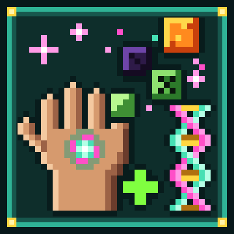

<p align="center">
  
</p>

<h1 align="center">Absorbaholic</h1>

<p align="center"><em>Sneak. Absorb. Become.</em></p>

Absorbaholic is a Minecraft mode in which you absorb the world around you. Sneak, hold use on a block or a
weakened mob, and it's gone. You keep one of its **traits** and one of its **weaknesses**. Absorb obsidian and
explosions barely scratch you, but you walk like a brick. Absorb a blaze and you shoot fireballs, but rain hurts.

It's a Fabric mod for Minecraft Java 26.2–26.3 (in [`fabric/`](fabric/)).

## What it does

When the mode is on, a player who sneaks with an **empty main hand** and holds **use** on something absorbable
does the following:

1. **Channel:** 1.5 seconds of holding, with particles and a rising hum. Letting go, looking away, taking the
   item back in hand or walking out of reach cancels it.
2. **Target:** a block (lava counts), or a living mob at **25 % health or less**. Blocks with no source entry,
   bedrock near the world floor and the Nether roof, and containers that still hold items can't be absorbed.
   You get a short message saying why.
3. **Consume:** the block disappears with no drops and no XP, and the mob vanishes with no loot and no XP.
4. **Levels:** the first absorption of a source gives its trait and its weakness at level I. Each repeat adds
   +1 to both, up to the source's max level (III for almost everything). Once the trait is maxed, you're
   refused and nothing is consumed.
5. **Roll:** every absorption rolls once. **15 % mutation:** 50/50 either the trait gets +2 (weakness +1) or the
   weakness gets +2 (trait +1). **2 % pure:** the trait gets +1 and the weakness nothing. Mutations and pure
   absorptions get their own sound and particles, and a chat broadcast.
6. **Slots:** each player holds up to 20 different sources (operators can change it per world). Absorbing a new
   one at the cap evicts your oldest source, with a notice.
7. **Feedback:** a title `🧬 Absorbed: Obsidian`, an actionbar `Blast Proof I · Dense I` and a sound. Each player
   can turn off the sound, the messages, or both (see [Notification settings](#notification-settings)).
8. **Cooldown:** 10 seconds per player before the next absorption.

Traits and weaknesses stay through death by default (per world: `/absorbaholic keep-on-death`). The dragon egg
is the exception: its weakness wipes **everything** on any death.

Creative and Spectator players never absorb, and their traits and weaknesses are dormant. Turning the mode off
makes every trait and weakness dormant too, and nobody loses anything: they wake up when the mode comes back.

More things you'll notice:

- **Hints:** sneak and look at something absorbable to see its source, trait and weakness. Sources nobody in
  the world has absorbed yet show `???`. Operators can turn hints off per world.
- **Traits screen:** press **K** (rebindable), run `/absorbaholic traits`, or use the button in the Mod Menu
  settings. Every source you carry, with its icon, levels, tier and a mutated/pure tag.
- **Aura:** players with traits give off faint particles in the mixed color of their sources.
- **Abilities** need no extra keys: sneak + swing at air, sneak + jump, jump in mid-air, or double-tap sneak.
  Only one ability fires per trigger (the oldest ready one).

## Notification settings

Every absorption shows a title and an actionbar line and plays a sound. Each player can turn off either one,
or both. With [Mod Menu](https://modrinth.com/mod/modmenu) installed, open Mods → Absorbaholic → the config
button, and switch **Absorb sound** / **Absorb messages**. Without Mod Menu, use the client command
`/absorbaholic-notify sound off`, `/absorbaholic-notify message off`, or `/absorbaholic-notify status`.

Settings are stored on your computer in `config/absorbaholic.json` and apply on any server that runs
Absorbaholic. Players who join without the mod on their client always get the default title, message and sound.

## Sources

Every absorbable thing belongs to a **source**. One source covers one block or mob, or a whole family through
tags (all logs, every ore of a metal, all flowers …), and has exactly one trait and one weakness. Sources come in
five tiers: Common, Uncommon, Rare, Epic and Legendary. Higher tiers are stronger on both sides.

All of them are data-driven JSON, so datapacks can change, add or remove any of them (see
[Datapacks](#datapacks)). The table below is generated from those files by
[`scripts/gen-source-table.py`](scripts/gen-source-table.py).

<!-- source-table:start -->
128 sources (56 block, 72 mob), sorted by tier. Numbers are per level (I/II/III); `−40 %` on damage means you take 40 % less.

| Source | Kind | Tier | Trait (I/II/III) | Weakness (I/II/III) | Max level |
|---|---|---|---|---|---|
| Coal (`coal`) | block | Common | **Slow Burner**: Hunger drain −10/−20/−30 % | **Sooty Lungs**: Drowning damage +50/+100/+150 % | III |
| Dirt (`dirt`) | block | Common | **Down to Earth**: Knockback resistance +10/+20/+30 % | **Weak Knees**: Safe fall distance −0.5/−1/−1.5 blocks | III |
| Flowers (`flowers`) | block | Common | **Sweet Scent**: Healing +10/+20/+35 % | **Wilting**: Hunger drain +50/+100/+150 % in darkness | III |
| Grass & Shrubs (`grass`) | block | Common | **Hide in the Grass**: Mob detection range −15/−30/−45 % while sneaking | **Bug Bait**: Detection range for arthropods +30/+60/+100 % | III |
| Gravel (`gravel`) | block | Common | **Flint Finder**: Luck +0.5/+1/+1.5 | **Pulled Down**: Gravity +10/+20/+30 % | III |
| Harvest (`harvest`) | block | Common | **Hearty Meals**: All food: saturation +15/+30/+50 % | **Rot-Prone**: Hunger duration +50/+100/+200 % | III |
| Leaves (`leaves`) | block | Common | **Photosynthesis**: Heals 0.5/0.75/1 HP every 3 s in sunlight | **Light as a Leaf**: Knockback taken +20/+40/+60 % | III |
| Masonry (`masonry`) | block | Common | **Reinforced**: Armor toughness +0.5/+1/+1.5; Explosion knockback resistance +10/+20/+30 % | **Concrete Shoes**: Sinks in water (0.015/0.025/0.035 blocks/tick²) | III |
| Melon (`melon`) | block | Common | **Juicy**: Heals 0.25/0.5/0.75 HP every 5 s | **Squishy**: Fall damage +20/+40/+60 % | III |
| Moss & Vines (`moss`) | block | Common | **Mossy Steps**: Sneaking speed +0.1/+0.2/+0.3 | **Overgrown**: Movement speed −3/−6/−9 % | III |
| Mud & Clay (`mud`) | block | Common | **Mud Mask**: Fire damage −15/−30/−45 % | **Slippery**: Friction −20/−35/−50 % | III |
| Mushrooms (`mushroom`) | block | Common | **Fungal Regrowth**: Heals 0.25/0.5/0.75 HP every 3 s in darkness | **Sun Shy**: Hunger drain +30/+60/+100 % in sunlight | III |
| Nether Rock (`nether_rock`) | block | Common | **Hellforged**: Burning time −25/−50/−75 % | **Rain Hater**: 0.25/0.5/0.75 HP per s in rain | III |
| Pumpkin (`pumpkin`) | block | Common | **Pumpkin Head**: Ignored by Enderman; Mob detection range −10/−20/−30 % | **Tunnel Vision**: Entity reach −0.2/−0.4/−0.6 blocks | III |
| Sand (`sand`) | block | Common | **Dune Walker**: Movement efficiency +25/+50/+75 % | **Sand in Your Boots**: Jump strength −5/−10/−15 % | III |
| Seaweed (`seaweed`) | block | Common | **Sea Eyes**: Oxygen bonus +0.5/+1/+2; Night Vision underwater | **Dry Fuel**: Fire damage +20/+40/+60 % | III |
| Snow (`snow`) | block | Common | **Frostproof**: Freezing damage −50/−75/−100 %; Speed I/I/II on snow | **Melting**: 0.25/0.5/0.75 HP per s in hot places | III |
| Stone (`stone`) | block | Common | **Rock Solid**: Armor +1/+2/+3 | **Stiff Joints**: Attack speed −5/−10/−15 % | III |
| Wood (`wood`) | block | Common | **Heartwood**: Max health +2/+3/+4 HP | **Kindling**: Fire damage +25/+50/+75 % | III |
| Woodwork (`woodwork`) | block | Common | **Carpenter**: Mining speed +10/+20/+30 % | **Creaky Floorboards**: Mob detection range +15/+30/+50 % | III |
| Wool (`wool`) | block | Common | **Soft Landing**: Safe fall distance +1/+2/+3 blocks | **Soggy Wool**: Slowness I/II/III when wet | III |
| Bat (`bat`) | mob | Common | **Echolocation**: Gives mobs within 6/10/14 blocks Glowing for 1.5 s in darkness | **Flimsy**: Max health −1/−2/−3 HP | III |
| Chicken (`chicken`) | mob | Common | **Feather Fall**: Fall damage −40/−70/−100 % | **Fox Bait**: Hunted by Fox & Ocelot within 16/24/32 blocks | III |
| Cow (`cow`) | mob | Common | **Milk Drinker**: Harmful effects duration −15/−30/−45 % | **Herbivore**: Meat: food value −20/−40/−60 % | III |
| Endermite (`endermite`) | mob | Common | **Pearl Hopper**: Ender pearl damage −50/−75/−100 % | **Enderman Snack**: Hunted by Enderman within 16/24/32 blocks | III |
| Fish (`fish`) | mob | Common | **Gills**: Oxygen bonus +1/+3/+6; Water movement efficiency +10/+20/+30 % | **Fish Out of Water**: Hunger drain +15/+30/+50 % when dry | III |
| Panda (`panda`) | mob | Common | **Chubby**: Max health +2/+3/+4 HP; Knockback resistance +5/+10/+15 % | **Lazy**: Movement speed −4/−8/−12 % | III |
| Pig (`pig`) | mob | Common | **Iron Stomach**: Hunger duration −50/−75/−100 % | **Pig Out**: Hunger drain +15/+30/+50 % | III |
| Rabbit (`rabbit`) | mob | Common | **Lucky Foot**: Luck +1/+2/+3 | **Prey Animal**: Hunted by Wolf & Fox within 16/24/32 blocks | III |
| Sheep (`sheep`) | mob | Common | **Woolly Coat**: Armor +1/+1.5/+2; Freezing damage −50/−75/−100 % | **Flammable Fluff**: Burning time +50/+100/+150 % | III |
| Silverfish (`silverfish`) | mob | Common | **Stone Burrower**: Mining efficiency +1/+3/+5 | **Squishable**: Max health −1/−2/−3 HP | III |
| Slime (`slime`) | mob | Common | **Gelatinous**: Fall damage −25/−50/−75 % | **Jiggly**: Attack damage −0.5/−1/−1.5 | III |
| Squid (`squid`) | mob | Common | **Ink Cloud**: Melee attackers get Blindness for 2/3/4 s (30/50/70 % chance) | **Calamari**: Fire damage +30/+60/+100 % | III |
| Zombie (`zombie`) | mob | Common | **Undead Vigor**: Max health +2/+3/+4 HP | **Sunburn**: Catches fire (2/4/6 s) in sunlight (a helmet protects) | III |
| Amethyst (`amethyst`) | block | Uncommon | **Long Reach**: Entity reach +0.5/+1/+1.5 blocks | **Chiming Steps**: Mob detection range +20/+40/+70 % | III |
| Bone Block (`bone_block`) | block | Uncommon | **Calcium Boost**: Armor toughness +1/+2/+3 | **Dog Treat**: Hunted by Wolf within 16/24/32 blocks | III |
| Cactus (`cactus`) | block | Uncommon | **Prickly**: Melee attackers take 1/1.5/2 damage (50/75/100 % chance); Immune to cactus & berry bush damage | **Slow Healer**: Natural regeneration −25/−40/−55 % | III |
| Cinnabar (`cinnabar`) | block | Uncommon | **Quicksilver**: Attack speed +10/+15/+20 % | **Mercury Poisoning**: Healing −15/−30/−45 % | III |
| Cobweb (`cobweb`) | block | Uncommon | **Sticky Strikes**: Melee hits inflict Slowness I/II/III for 2/3/4 s | **Spider Snack**: Hunted by Spider & Cave Spider within 16/24/32 blocks | III |
| Copper (`copper`) | block | Uncommon | **Conductor**: Attack speed +5/+10/+15 %; Lightning damage −50/−75/−100 % | **Oxidizing**: Mining Fatigue I/II/III when wet | III |
| Coral (`coral`) | block | Uncommon | **Reef Rest**: Heals 0.5/1/1.5 HP every 3 s in water | **Bleaching**: Hunger drain +30/+60/+100 % in sunlight and when dry | III |
| End Stone (`end_stone`) | block | Uncommon | **Low Gravity**: Gravity −10/−20/−30 % | **Otherworldly**: Hunger drain +15/+30/+50 % outside the End | III |
| Glass (`glass`) | block | Uncommon | **Glass Cannon**: Attack damage +1/+2/+3 | **Fragile**: Max health −2/−4/−6 HP | III |
| Glowing Blocks (`glow_blocks`) | block | Uncommon | **Glow Aura**: Night Vision; Gives hostile mobs within —/8/16 blocks Glowing for 2 s | **Walking Lantern**: Mob detection range +30/+60/+100 % | III |
| Gold (`gold`) | block | Uncommon | **Midas Luck**: Luck +1/+2/+3 | **Soft Metal**: Item wear +25/+50/+100 % | III |
| Honey (`honey`) | block | Uncommon | **Sweet Tooth**: Honey Bottle, Sweet Berries +5 more: food value +50/+100/+150 %; Poison duration −25/−50/−75 % | **Honey Thief**: Hunted by Bee within 16/24/32 blocks | III |
| Ice (`ice`) | block | Uncommon | **Frost Walker**: Freezes water underfoot (radius 2/3/4) | **Melts in Flames**: Burning time +100/+150/+200 % | III |
| Iron (`iron`) | block | Uncommon | **Iron Skin**: Armor +2/+3/+4 | **Sinks Like Iron**: Sinks in water (0.025/0.04/0.055 blocks/tick²) | III |
| Lapis Lazuli (`lapis`) | block | Uncommon | **Wisdom**: XP from orbs +20/+40/+60 % | **Mana Allergy**: Magic damage +25/+50/+100 % | III |
| Magma Block (`magma_block`) | block | Uncommon | **Hot Touch**: Sets hostile mobs within 1/1.5/2 blocks on fire for 2/3/4 s; Immune to magma floor damage | **Snow Allergy**: 0.5/1/1.5 HP per s in the cold; Snowball hits deal 1/2/3 extra damage | III |
| Nether Quartz (`quartz`) | block | Uncommon | **Sharp Edges**: Attack damage +0.5/+1/+1.5 | **Pincushion**: Projectile damage +15/+30/+45 % | III |
| Prismarine (`prismarine`) | block | Uncommon | **Aqua Affinity**: Underwater mining speed +0.3/+0.5/+0.8 | **Sea-Bound**: Hunger drain +15/+30/+50 % out of water | III |
| Redstone (`redstone`) | block | Uncommon | **Overclocked**: Movement speed +5/+10/+15 % | **Short Circuit**: 0.5/0.75/1 HP per s when wet | III |
| Slime Block (`slime_block`) | block | Uncommon | **Bouncy**: Bounciness +0.3/+0.5/+0.7; Fall damage −30/−60/−90 %; Jump strength +5/+10/+15 % | **Wobbly**: Knockback taken +50/+75/+100 % | III |
| Soul Sand (`soul_sand`) | block | Uncommon | **Soul Speed**: Movement efficiency +30/+60/+100 %; Speed I/II/III on soul sand/soil | **Soul Drag**: Movement speed −4/−8/−12 % | III |
| Sponge (`sponge`) | block | Uncommon | **Absorbent**: Oxygen bonus +2/+5/+8 | **Waterlogged**: Hunger drain +100/+200/+300 % when wet | III |
| Sulfur (`sulfur`) | block | Uncommon | **Noxious Fumes**: Gives hostile mobs within 2/3/4 blocks Weakness for 3 s | **Rotten-Egg Stench**: Scares off Cow, Pig +10 more within 8/12/16 blocks | III |
| TNT (`tnt`) | block | Uncommon | **Kaboom Punch**: Attack knockback +0.5/+1/+1.5 | **Volatile**: Fire damage +50/+100/+150 % | III |
| Armadillo (`armadillo`) | mob | Uncommon | **Roll Up**: Damage taken −20/−35/−50 % while sneaking | **Undead Jitters**: Slowness I/II/III near undead (8 blocks) | III |
| Axolotl (`axolotl`) | mob | Uncommon | **Play Dead**: Heals 1/1.5/2 HP every 2 s at low health | **Dries Out**: 0.25/0.5/0.75 HP per s when dry and in sunlight | III |
| Bogged (`bogged`) | mob | Uncommon | **Toxic Arrows**: Projectile hits inflict Poison for 3/4/6 s | **Swamp Rot**: Healing −20/−35/−50 % | III |
| Camel (`camel`) | mob | Uncommon | **Desert Endurance**: Hunger drain −20/−35/−50 % | **Humpback**: Size +5/+10/+15 % | III |
| Cat (`cat`) | mob | Uncommon | **Cat Presence**: Scares off Creeper & Phantom within 6/10/14 blocks | **Hates Water**: Slowness I/II/III in water | III |
| Cave Spider (`cave_spider`) | mob | Uncommon | **Venomous**: Melee hits inflict Poison for 3/5/7 s | **Fragile Frame**: Max health −2/−3/−4 HP | III |
| Copper Golem (`copper_golem`) | mob | Uncommon | **Sticky Fingers**: Pulls items within 2/3/4 blocks | **Oxidizing**: Slowness I/II/III when wet | III |
| Drowned (`drowned`) | mob | Uncommon | **Swift Swimmer**: Water movement efficiency +33/+66/+100 % | **Sunburn**: Catches fire (2/3/5 s) in sunlight (a helmet protects) | III |
| Fox (`fox`) | mob | Uncommon | **Night Stalker**: Night Vision at night; Mob detection range −10/−20/−30 % at night | **Drowsy by Day**: Natural regeneration −20/−40/−60 % by day | III |
| Frog (`frog`) | mob | Uncommon | **Big Leap**: Jump strength +15/+30/+45 %; Safe fall distance +1/+2/+3 blocks | **Cold-Blooded**: Slowness I/II/III in the cold; Freezing damage +50/+100/+200 % | III |
| Goat (`goat`) | mob | Uncommon | **Mountain Climber**: Step height +0.2/+0.4/+0.5 blocks; Safe fall distance +1/+2/+3 blocks | **Clumsy Hooves**: Block reach −0.5/−1/−1.5 blocks | III |
| Guardian (`guardian`) | mob | Uncommon | **Spiked Hide**: Melee attackers take 1/2/3 damage (30/50/70 % chance) | **Flop**: Fall damage +50/+100/+150 % | III |
| Hoglin (`hoglin`) | mob | Uncommon | **Tusk Toss**: Attack knockback +0.5/+1/+1.5 | **Piglin Prey**: Hunted by Piglin & Piglin Brute within 16/24/32 blocks | III |
| Horse (`horse`) | mob | Uncommon | **Gallop**: Movement speed +6/+12/+18 % | **Heavy Hooves**: Fall damage +25/+50/+75 % | III |
| Husk (`husk`) | mob | Uncommon | **Hunger Touch**: Melee hits inflict Hunger I/I/II for 5/8/11 s | **Crumbling**: Knockback taken +15/+30/+45 % | III |
| Illagers (`illager`) | mob | Uncommon | **Raider's Edge**: Attack damage +0.5/+1/+1.5; Projectile damage dealt +10/+20/+30 % | **Golem's Grudge**: Hunted by Iron Golem within 16/24/32 blocks | III |
| Llama (`llama`) | mob | Uncommon | **Spit Take**: Sneak-swing: 1× llama spit (2/3/4 damage, cooldown 3/2/1 s) | **Picky Eater**: All food: food value −15/−30/−45 % | III |
| Magma Cube (`magma_cube`) | mob | Uncommon | **Lava Bounce**: Jump strength +10/+20/+30 %; Fall damage −20/−40/−60 %; Immune to magma floor damage | **Cools Off**: Weakness I/II/III in water | III |
| Mooshroom (`mooshroom`) | mob | Uncommon | **Stew Belly**: Mushroom Stew, Suspicious Stew +2 more: food value +50/+100/+200 % | **Lightning Magnet**: 0.5/1/1.5 HP per s in thunderstorms and under open sky; Lightning damage +100/+200/+300 % | III |
| Nautilus (`nautilus`) | mob | Uncommon | **Nautilus Breath**: Water movement efficiency +10/+20/+30 %; Breath of the Nautilus underwater | **Drowned Prey**: Detection range for Drowned +50/+100/+200 % | III |
| Ocelot (`ocelot`) | mob | Uncommon | **Jungle Sprinter**: Movement speed +5/+10/+15 % | **Skittish**: Knockback taken +20/+40/+60 % | III |
| Parched (`parched`) | mob | Uncommon | **Parching Shot**: Projectile hits inflict Weakness I/I/II for 3/5/7 s | **Eternal Thirst**: Hunger drain +20/+40/+60 % when dry | III |
| Parrot (`parrot`) | mob | Uncommon | **Flutter**: Gravity −10/−20/−30 %; Fall damage −20/−40/−60 % | **Chatterbox**: Mob detection range +20/+40/+60 %; Eating cookies gives Poison I/I/II for 5/8/10 s | III |
| Piglin (`piglin`) | mob | Uncommon | **Piglin Pal**: Attack damage +0.5/+1/+1.5; Ignored by Piglin | **Zombifying**: Healing −20/−40/−60 % outside the Nether | III |
| Polar Bear (`polar_bear`) | mob | Uncommon | **Arctic Fur**: Attack damage +1/+1.5/+2; Freezing damage −50/−75/−100 % | **Overheating**: Slowness I/II/III in hot places | III |
| Pufferfish (`pufferfish`) | mob | Uncommon | **Puff Up**: Melee attackers get Poison I/I/II for 3/5/7 s | **Inflated**: Size +5/+10/+15 % | III |
| Skeleton (`skeleton`) | mob | Uncommon | **Marksman**: Projectile damage dealt +15/+30/+50 % | **Sunburn**: Catches fire (3/5/8 s) in sunlight (a helmet protects) | III |
| Snow Golem (`snow_golem`) | mob | Uncommon | **Snowballer**: Sneak-swing: 1/2/3× snowball (1/1.5/2 damage, cooldown 1/0.75/0.5 s); Immune to freezing damage | **Melting**: 0.25/0.5/0.75 HP per s in hot places or when wet | III |
| Spider (`spider`) | mob | Uncommon | **Wall Crawler**: Climbs walls like a ladder | **Venom Weakness**: Poison duration +50/+100/+150 %; Poison amplifier +0/+0/+1 | III |
| Stray (`stray`) | mob | Uncommon | **Frost Arrows**: Projectile hits inflict Slowness I/II/III for 3/4/5 s; Freezing damage −50/−75/−100 % | **Melting**: 0.25/0.5/0.75 HP per s in hot places | III |
| Strider (`strider`) | mob | Uncommon | **Lava Strider**: Walks on lava; Fire damage −15/−30/−45 % | **Shivers**: Slowness I/II/III when wet or in the cold | III |
| Turtle (`turtle`) | mob | Uncommon | **Shell Armor**: Armor +1/+2/+3 | **Slowpoke**: Movement speed −5/−10/−15 % | III |
| Villager (`villager`) | mob | Uncommon | **Home Cooking**: Bread, Carrot +9 more: food value +25/+50/+100 % | **Zombie Bait**: Damage from zombies +25/+50/+100 % | III |
| Wolf (`wolf`) | mob | Uncommon | **Pack Hunter**: Attack damage +1/+1.5/+2 | **Bone Rivalry**: Detection range for skeletons +30/+60/+100 % | III |
| Zombified Piglin (`zombified_piglin`) | mob | Uncommon | **Fire-Blooded**: Fire damage −20/−40/−60 % | **Pigman Grudge**: Hunted by Zombified Piglin within 16/24/32 blocks | III |
| Chorus (`chorus`) | block | Rare | **Chorus Hop**: Sneak-jump: random teleport, up to 8/12/16 blocks (cooldown 10/8/6 s) | **Unstable Matter**: When hurt: 10/20/30 % chance of a random teleport (4/6/8 blocks) | III |
| Crying Obsidian (`crying_obsidian`) | block | Rare | **Last Stand**: Damage taken −20/−35/−50 % at low health | **Teary Eyes**: Blindness for 2/2.5/3 s every 6/5/4 s at low health | III |
| Diamond (`diamond`) | block | Rare | **Diamond Skin**: Armor +3/+5/+7; Armor toughness +1/+2/+3 | **Brittle Brilliance**: Explosion damage +50/+100/+150 % | III |
| Emerald (`emerald`) | block | Rare | **Haggler**: Hero of the Village I/II/III | **Wanted Poster**: Hunted by Iron Golem within 16/24/32 blocks | III |
| Obsidian (`obsidian`) | block | Rare | **Blast Proof**: Explosion knockback resistance +30/+60/+100 %; Explosion damage −40/−60/−75 % | **Dense**: Movement speed −10/−20/−30 % | III |
| Sculk (`sculk`) | block | Rare | **Soul Harvest**: Kills heal 1/2/3 HP | **Soul Tax**: XP from orbs −25/−50/−75 % | III |
| Allay (`allay`) | mob | Rare | **Collector**: Pulls items within 4/6/8 blocks | **Delicate**: Max health −2/−4/−6 HP | III |
| Bee (`bee`) | mob | Rare | **Buzz Hover**: 1/2/3 mid-air jumps | **Nectar Addict**: Hunger drain +30/+60/+100 %; 1/2/3 HP per s when starving | III |
| Blaze (`blaze`) | mob | Rare | **Blaze Barrage**: Sneak-swing: 1/2/3× small fireball (cooldown 2/1.5/1 s); Fire damage −40/−60/−75 % | **Snowball Bane**: Snowball hits deal 2/3/4 extra damage; 0.5/1/1.5 HP per s when wet | III |
| Breeze (`breeze`) | mob | Rare | **Wind Burst**: Sneak-swing: 1× wind charge (cooldown 3/2/1.5 s) | **Gust-Blown**: Knockback taken +30/+60/+90 % | III |
| Creaking (`creaking`) | mob | Rare | **Resin Heart**: Heals 0.5/1/1.5 HP every 2 s at night | **Sun-Stiff**: Slowness I/II/III in sunlight | III |
| Creeper (`creeper`) | mob | Rare | **Controlled Blast**: Double-tap sneak: explode (power 2/2.5/3, no block damage, cooldown 30/25/20 s); Explosion damage −20/−35/−50 % | **Cat Phobia**: Slowness I/II/III near Cat & Ocelot (10 blocks) | III |
| Dolphin (`dolphin`) | mob | Rare | **Dolphin's Grace**: Oxygen bonus +1/+2/+4; Dolphin's Grace in water | **Air Breather**: Drowning damage +50/+100/+200 % | III |
| Ghast (`ghast`) | mob | Rare | **Fireball**: Sneak-swing: 1× fireball (power 1/1/2, cooldown 5/4/3 s) | **Paper Thin**: Projectile damage +25/+50/+100 % | III |
| Happy Ghast (`happy_ghast`) | mob | Rare | **Cloud Floater**: Gravity −20/−35/−50 %; Slow Falling while sneaking and in mid-air | **Big Softie**: Size +10/+15/+20 %; Attack damage −0.5/−1/−1.5 | III |
| Piglin Brute (`piglin_brute`) | mob | Rare | **Brute Force**: Attack damage +2/+3/+4; Knockback resistance +10/+20/+30 % | **Hot-Headed**: Hunted by Piglin, Piglin Brute & Zombified Piglin within 16/24/32 blocks | III |
| Sniffer (`sniffer`) | mob | Rare | **Long Snout**: Block reach +1/+1.5/+2 blocks; Luck +0.5/+1/+1.5 | **Ancient Pace**: Movement speed −6/−12/−18 % | III |
| Vex (`vex`) | mob | Rare | **Spectral Blade**: Attack damage +1/+2/+3 | **Fading**: Healing −30/−50/−65 % | III |
| Witch (`witch`) | mob | Rare | **Brew Master**: Beneficial effects duration +25/+50/+100 % | **Bad Brew**: Harmful effects duration +25/+50/+100 % | III |
| Wither Skeleton (`wither_skeleton`) | mob | Rare | **Withering Blade**: Melee hits inflict Wither for 3/5/7 s | **Brittle Bones**: Fall damage +30/+60/+100 % | III |
| Ancient Debris (`ancient_debris`) | block | Epic | **Netherite Hide**: Damage taken −15/−25/−35 % | **Bottomless Appetite**: Hunger drain +50/+100/+150 % | III |
| Bedrock (`bedrock`) | block | Epic | **Immovable**: Knockback resistance +40/+70/+100 %; Armor +2/+4/+6 | **Leaden Legs**: Jump strength −10/−25/−37 % | III |
| Lava (`lava`) | block | Epic | **Magma Blood**: Fire damage −50/−75/−100 % | **Hydrophobic**: 1/1.5/2 HP per s when wet | III |
| Enderman (`enderman`) | mob | Epic | **Blink**: Sneak-jump: blink where you look, up to 8/12/16 blocks (cooldown 5/4/3 s) | **Ender Outcast**: 0.5/1/1.5 HP per s when wet; Hunted by Enderman within 16/32/48 blocks | III |
| Evoker (`evoker`) | mob | Epic | **Fang Summoner**: Sneak-swing: 5/8/12× evoker fangs (6 damage, cooldown 8/6/4 s) | **Hollow Soul**: Max health −2/−4/−6 HP; Hunted by Iron Golem within 16/24/32 blocks | III |
| Iron Golem (`iron_golem`) | mob | Epic | **Titan Strength**: Attack damage +3/+5/+7; Attack knockback +0.5/+1/+1.5; Knockback resistance +20/+40/+60 %; Scares off zombies, skeletons, spiders & raiders within 4/6/8 blocks | **Iron Anchor**: Movement speed −5/−10/−15 %; Sinks in water (0.04/0.06/0.08 blocks/tick²) | III |
| Phantom (`phantom`) | mob | Epic | **Night Glide**: Glides without an elytra for up to 5/10/20 s | **Sunburn**: Catches fire (3/5/8 s) in sunlight (a helmet protects) | III |
| Ravager (`ravager`) | mob | Epic | **Stampede**: Attack damage +2/+3/+4; Attack knockback +1/+1.5/+2; Knockback resistance +20/+40/+60 % | **Lumbering Beast**: Size +10/+15/+20 %; Movement speed −5/−10/−15 % | III |
| Shulker (`shulker`) | mob | Epic | **Shulker Shot**: Armor +2/+3/+4; Sneak-swing: 1× shulker bullet (cooldown 4/3/2 s) | **Shell-Bound**: Movement speed −8/−14/−20 % | III |
| Beacon (`beacon`) | block | Legendary | **Beacon Blessing**: Haste II/II/III; Speed —/I/II; Regeneration —/—/I | **Skybound**: Mining Fatigue I/II/III under a roof; Mob detection range +50/+100/+150 % | III |
| Dragon Egg (`dragon_egg`) | block | Legendary | **Dragon Flight**: Creative-style flight, grounded for 5 s after combat | **All or Nothing**: Any death wipes **all** your traits | I |
| Elder Guardian (`elder_guardian`) | mob | Legendary | **Lord of the Deep**: Water movement efficiency +30/+60/+100 %; Conduit Power I/II/III in water; Melee attackers take 2/3/4 damage in water | **Monument-Bound**: Mining Fatigue I/II/III out of water | III |
| Ender Dragon (`ender_dragon`) | mob | Legendary | **Dragon's Breath**: Max health +4/+8/+12 HP; Sneak-swing: 1× dragon fireball (cooldown 10/7/5 s); Damage taken −10/−15/−20 % | **Crystal Bane**: Explosion damage +50/+100/+200 %; Hunted by Enderman within 32/48/64 blocks | III |
| Warden (`warden`) | mob | Legendary | **Sonic Boom**: Max health +4/+6/+8 HP; Sneak-swing: sonic boom, 6/8/10 damage, 10/15/20 blocks (cooldown 10/8/6 s); Immune to Blindness & Darkness | **Echo Darkness**: Darkness for 3/4/5 s every 10/8/6 s | III |
| Wither (`wither`) | mob | Legendary | **Wither's Wrath**: Melee hits inflict Wither I/II/II for 5/5/7 s; Kills heal 2/4/6 HP; Immune to Wither | **Hollow Heart**: Max health −4/−7/−10 HP; Instant Health hurts instead of healing | III |
<!-- source-table:end -->

## Safety caps

Traits stack, but never without limit. Everything below is enforced centrally by the mod, whatever the data says,
so a datapack can't break it either. The numbers are generated from
[`AbsorbCaps`](fabric/src/main/java/dev/absorbaholic/core/AbsorbCaps.java).

<!-- caps-table:start -->
| Cap | Value |
|---|---|
| Absorb channel | hold 30 ticks (1.5 s) |
| Cooldown after an absorption | 10 s per player |
| Mob health to absorb it | at most 25 % of its max health |
| Pure / mutation chance | 2 % / 15 % per absorption |
| Source max level | default 3, allowed 1–5 |
| Trait slots per player | default 20, `/absorbaholic max` 1–64 |
| Weakness damage | at most 8 HP (and at most your max health − 1) per 20 ticks, weakness-caused burning and starvation included; if you were at full health during that time, weaknesses never take you below 1 HP |
| Damage taken (all traits combined) | never below ×0.25 (max 75 % reduction); weaknesses at most ×3 |
| Immunities | only fire, fall, drowning, freezing, magma floor, cactus, berry bush, lightning and ender pearl damage; never `/kill`, the void or generic damage |
| Damage dealt | ×0.5–×2 |
| Healing | ×0.25–×2 |
| Hunger drain | ×0.25–×5 |
| Knockback taken | ×0.5–×3 |
| XP from orbs | ×0.25–×2.5 |
| Item wear | ×0.5–×3 |
| Mob detection range | ×0.25–×3, provoking at most 48 blocks away |
| Effect amplifier from weaknesses | at most level V |
| Active abilities | cooldown ≥ 1 s, range ≤ 24 blocks, ≤ 8 targets, 1 exhaustion per use (0.5 per air jump); one ability per trigger, sneak-swing at most once per 4 ticks |
| Teleport / sonic boom / evoker fangs | ≤ 16 blocks / ≤ 20 blocks / ≤ 16 fangs |
| Explosions | power ≤ 3 (fireballs ≤ 2), never break blocks |
| Flight | speed ≤ 1, 0.01 exhaustion per tick; losing it mid-air gives 10 s of Slow Falling |
| Auras / item magnet | radius ≤ 16 / ≤ 10 blocks (≤ 64 items per pulse) |
| Mob scans (fear, hunting, detection) | ≤ 64 blocks, ≤ 48 mobs per scan |
| World protection | bedrock (`#absorbaholic:bedrock_protected`) can't be absorbed in the bottom 5 layers, in the top 5 under the Nether roof, or anywhere in the End |

Attribute clamps (on the final value, whatever else changes it):

| Attribute | Range |
|---|---|
| Movement speed | ×0.4–×2 of base |
| Size | 0.5–2 |
| Max health | 6–60 HP |
| Block reach | 2.5–8 blocks |
| Entity reach | 2–6 blocks |
| Jump strength | 0.2–1.2 |
| Step height | 0.6–2 blocks |
| Armor | 0–30 |
| Armor toughness | 0–20 |
| Attack damage | base −0.5 to base +20 |
| Attack speed | ×0.5–×2 of base |
| Attack knockback | 0–3 |
| Knockback resistance | 0–1 |
| Gravity | 0.02–0.16 |
| Safe fall distance | 1–24 blocks |
| Fall damage multiplier | 0–3 |
| Luck | −5 to 5 |
| Oxygen bonus | 0–8 |
| Burning time multiplier | 0–3 |
| Water movement efficiency | 0–1 |
| Movement efficiency | 0–1 |
| Mining speed | ×0.25–×4 of base |
| Mining efficiency | 0–40 |
| Underwater mining speed | 0.2–1 |
| Sneaking speed | 0.15–1 |
| Explosion knockback resistance | 0–1 |
| Max absorption | 0–20 |
<!-- caps-table:end -->

## Commands

| Command | Who | What it does |
|---|---|---|
| `/absorbaholic` | anyone | Shows every setting of this world |
| `/absorbaholic on\|off\|status` | operators (level 2) | Turns Absorbaholic Mode on or off for this world |
| `/absorbaholic keep-on-death on\|off\|status` | operators | Whether traits survive death (default on) |
| `/absorbaholic hints on\|off\|status` | operators | The sneak hint near the crosshair (default on) |
| `/absorbaholic max [n]` | operators | Trait slots per player, 1–64 (default 20). Lowering it never removes traits already held |
| `/absorbaholic traits` | anyone | Your own traits (the traits screen with the mod, a chat list without it) |
| `/absorbaholic traits <player>` | operators | Someone else's traits |
| `/absorbaholic remove <player> <source>` | operators | Removes one source from a player (suggests their sources) |
| `/absorbaholic reset <player>` | operators | Removes all of a player's sources |
| `/absorbaholic-notify sound\|message\|status [on\|off]` | anyone, client side | Your own [notification settings](#notification-settings) |

In single-player, operator commands need cheats: Allow Commands on, or Open to LAN with Allow Cheats on.

## Install

1. Install [Fabric Loader](https://fabricmc.net/use/) 0.19.5+ for Minecraft 26.2 or 26.3, and run the game on
   Java 25.
2. Put [Fabric API](https://modrinth.com/mod/fabric-api) and `absorbaholic-<version>.jar` in your `mods/` folder,
   on the server **and** on every client. Get the jar from
   [GitHub releases](https://github.com/nezo32/absorbaholic/releases) or CurseForge.
   Optional: [Mod Menu](https://modrinth.com/mod/modmenu) for the settings screen.
3. Turn the mode on in one of two ways:
   - **New world:** Create World → Game tab → **Absorbaholic Mode** (right below Difficulty) is **ON** by
     default (switch it off there for a normal world).
   - **Existing world or dedicated server:** an operator runs `/absorbaholic on`. Worlds made without the button
     (dedicated servers, other launchers) start with it off.

## Datapacks

Sources live in `data/<namespace>/absorbaholic/source/<path>.json`, and the source id is `<namespace>:<path>`.
A datapack file with the same id replaces the built-in one; a new id adds a source. After `/reload` the new set
is sent to every player.

**Schema** (one file = one source):

```json
{
  "kind": "block",
  "targets": ["minecraft:obsidian", "#minecraft:logs"],
  "name": "mypack.source.obsidian",
  "icon": "minecraft:obsidian",
  "color": "#3B2754",
  "tier": "rare",
  "max_level": 3,
  "trait": {
    "key": "blast_proof",
    "attributes": [
      { "attribute": "minecraft:explosion_knockback_resistance", "operation": "add_value", "amount": [0.3, 0.6, 1.0] }
    ],
    "behaviors": [
      { "type": "absorbaholic:damage_multiplier", "damage_tag": "minecraft:is_explosion", "multiplier": [0.6, 0.4, 0.25] }
    ]
  },
  "weakness": {
    "key": "dense",
    "attributes": [
      { "attribute": "minecraft:movement_speed", "operation": "add_multiplied_total", "amount": [-0.1, -0.2, -0.3] }
    ]
  }
}
```

| Field | Meaning |
|---|---|
| `kind` | `block` or `entity`. Fluids use their block (`minecraft:lava`) |
| `targets` | Block or entity type ids and `#tags`. A direct id beats a tag; between two equal matches the smaller source id wins (logged as a warning) |
| `name` | Optional translation key for the source name. Default: the first target's name |
| `icon` | Optional item for screens. Default: the block's item or the mob's spawn egg |
| `color` | Aura color, `#RRGGBB` |
| `tier` | `common`, `uncommon`, `rare`, `epic` or `legendary` |
| `max_level` | 1–5, default 3 |
| `trait`, `weakness` | `key` (names come from `absorbaholic.trait.<key>` / `absorbaholic.weakness.<key>` and their `.desc`), plus any `attributes` and `behaviors` |
| `attributes[]` | Any attribute id, `operation` `add_value` / `add_multiplied_base` / `add_multiplied_total`, `amount` |
| `behaviors[]` | `type` (`absorbaholic:<id>`) plus that behavior's parameters. The shipped files use all 30 types; the catalog with every parameter is in the Javadoc of each class in [`trait/behavior/`](fabric/src/main/java/dev/absorbaholic/trait/behavior/) |

Level-scaled numbers (`amount`, `multiplier`, `radius` …) are either an array indexed by level (I, II, III …), at
least `max_level` long, or a single number multiplied by the level. Every behavior accepts the shared
`condition` / `condition_any` fields (`in_water`, `wet`, `in_sunlight`, `in_darkness`, `sneaking`, `low_health`,
`!in_nether` …).

**Disable a source:** a file with the same id containing `{"disabled": true}`.

**Tags:**

| Tag | Effect |
|---|---|
| `absorbaholic:unabsorbable` (block and entity_type) | Never absorbable, whatever the sources say. Ships air, water, portals, technical blocks, spawners, vaults, reinforced deepslate, frosted ice, players, armor stands … |
| `absorbaholic:bedrock_protected` (block) | Protected in the bottom 5 layers of a dimension and at the Nether roof. Ships `minecraft:bedrock` |
| `absorbaholic:fears_golem` (entity_type) | Mobs that flee from the Iron Golem trait. Creepers, bosses, the Warden and the Ravager never flee, even if you add them |

A broken file never stops the server: it's skipped with one warning in the log naming the file and the reason
(unknown attribute, unknown behavior type, bad parameter, array shorter than `max_level` …).

### Adding a custom behavior (developers)

A behavior type is one class, one registration line and (only if it prints something) lang entries:

1. Create `fabric/src/main/java/dev/absorbaholic/trait/behavior/<Name>Behavior.java` implementing
   [`Behavior<P>`](fabric/src/main/java/dev/absorbaholic/trait/Behavior.java). `P` is a record with a
   `MapCodec`; use `LevelValue.CODEC` for level-scaled numbers (array lengths are then checked for free),
   `Condition.FIELDS` for the shared conditions and `TargetFilter.CODEC` for entity filters. Override only the
   hooks you need (`tick`, `incomingDamageFactor`, `onKill`, `onSneakSwing` …). The engine detects them and calls
   only those.
2. Register it in its group registrar (`CombatBehaviors`, `EnvironmentBehaviors`, `MobBehaviors`,
   `MovementBehaviors`, `AbilityBehaviors` or `MiscBehaviors`):
   `BehaviorRegistry.register("<type_path>", Params.CODEC, new <Name>Behavior())`.
3. Use it from any source JSON as `"type": "absorbaholic:<type_path>"`.

Rules: return raw factors and let the engine clamp (every cap is in `AbsorbCaps`); send direct damage to the
player through `WeaknessDamage.hurt` so the damage gate applies; keep per-player state in `PlayerRuntime`, never
in the behavior; give every active ability a cooldown. The reference implementation is
[`DamageMultiplierBehavior`](fabric/src/main/java/dev/absorbaholic/trait/behavior/DamageMultiplierBehavior.java).
Also add a formatter to `scripts/gen-source-table.py`; without one, the generated table falls back to the lang
description.

## Known quirks

- **The mod is needed on both sides.** Players without it on their client can't absorb (vanilla use works as
  usual for them). Traits they already have still work on the server: attributes, damage, effects, and abilities
  triggered by sneak-jump, sneak-swing and double-tap. Wall climbing, lava walking and gliding don't, and they
  get no hint, screen or aura. Their messages come in English, and deaths from weakness damage show a raw
  translation key.
- **Removed sources stay stored.** When a datapack removes or disables a source, players keep the entry, but it
  does nothing. The traits screen shows it greyed out with its id, and `/absorbaholic remove` cleans it up.
  Re-adding the source brings it back.
- **Containers must be empty.** A chest, barrel, furnace or shulker box with items in it is refused, so nothing is
  deleted by accident.
- **Bedrock near the floor is protected.** It can be absorbed elsewhere (for example a block you placed higher
  up), but never in the bottom 5 layers or at the Nether roof.
- **Absorbing the Ender Dragon** counts as killing it: the exit portal and the egg appear as usual.
- **Other attribute mods stack with ours.** The clamps apply to the final value, so our modifiers shrink to keep
  it in range. If another mod (or an effect) already pushed a value past a clamp, we just don't push it further.
- **Weakness damage is gated, not delayed.** Anything over 8 HP per second (less with a low max health) is
  dropped for good, and so is anything that would take a player who was at full health that second below 1 HP.
- **Keep-on-death off** means a death loses every source; the dragon egg wipes them even with it on.

## Repository layout

| Path | Contents |
|---|---|
| `fabric/` | Fabric mod (Gradle) |
| `.github/workflows/` | CI (`ci.yml`), release (`release.yml`) and the reusable `reusable-*.yml` workflows |
| `scripts/` | CurseForge upload script, the source/caps table generator and their tests |
| `docs/ci/` | Release runbook and reusable pipeline docs |
| `docs/branding/` | Logo, palette, CurseForge page, player-facing strings |

## Development

The mod needs JDK 25. Gradle can also run on Java 21 and download a JDK 25 toolchain.

```bash
cd fabric
./gradlew build          # Minecraft 26.3: compile, JUnit, server GameTests; jars in build/libs/
./gradlew clean build -Pmc=26.2   # the same against 26.2
```

One jar runs on both 26.2 and 26.3. The Create World toggle, the traits screen and the notification title are
covered by client GameTests (`./gradlew runClientGameTest`). They need a display (for example Xvfb), so `build`
and CI don't run them.

After changing a source JSON, a lang file or `AbsorbCaps`, regenerate the tables in this README and in
`docs/branding/branding.md` (CI checks them):

```bash
python3 scripts/gen-source-table.py            # rewrite
python3 scripts/gen-source-table.py --check    # what CI runs
```

Branch names, PR rules and the full list of local checks are in [CONTRIBUTING.md](CONTRIBUTING.md).

## Releasing

To release, push an annotated `vX.Y.Z` tag on a commit of `main` (pre-releases use `-alpha.N`, `-beta.N` or `-rc.N`).
`release.yml` then does the rest:

1. Builds and tests the jar, stamping the tag's version into it.
2. Creates the GitHub release with notes generated from PR titles and labels.
3. Uploads the jar to CurseForge.

Don't edit the version in `fabric/gradle.properties` by hand. The tag sets the version.

Repository settings (Settings → Secrets and variables → Actions):

| Kind | Name | Value |
|---|---|---|
| secret | `CURSEFORGE_TOKEN` | CurseForge API token |
| variable | `CURSEFORGE_PROJECT_ID` | Numeric id of the CurseForge project. Empty = the CurseForge upload is skipped |
| variable (optional) | `CURSEFORGE_GAME_VERSIONS` | Default `26.2,26.3,Fabric,Java 25,Client,Server` |
| variable (optional) | `CURSEFORGE_ENVIRONMENT` | GitHub Environment the upload job runs in. Default `Absorbaholic` |

- Maintainer runbook: [docs/ci/RELEASING.md](docs/ci/RELEASING.md)
- How the reusable pipeline works and how other projects can use it:
  [docs/ci/REUSABLE_RELEASE_PIPELINE.md](docs/ci/REUSABLE_RELEASE_PIPELINE.md)

## License

[MIT](LICENSE) © 2026 nezo
